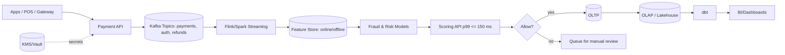

# Full-Stack Developer’s Knowledge Playbook

_Includes VakıfBank 2025 Assessment Prep + Java, System Design & Patterns Deep Dive_  
**Prepared by Orçun Yörük**

<p align="center">
  
</p>


> **New:** FinTech Analytics Addendum — payments KPIs, fraud/risk patterns, real-time scoring, and experimentation notes.  
> **Demo GIF:** See the one-page simulation below.

---

## Quick Nav
- [📑 Abstract](#-abstract)
- [1. Introduction](#1-introduction)
- [2. Exam Overview](#2-exam-overview)
- [3. Java & OOP](#3-java--oop-deep-dive)
- [4. SQL](#4-sql--database-optimization)
- [5. System Design](#5-system-design-essentials)
- [6. CI/CD](#6-cicd-best-practices)
- [7. Testing](#7-testing-strategies)
- [8. Big-O (At-a-glance)](#8-big-o--algorithms)
- [**11. FinTech Addendum (NEW)**](#11-fintech-analytics-addendum-new)
- [📚 Further Reading](#-further-reading--exploration)

---

## 🎞️ Simulation GIF (FinTech Strategy Toggle)


<sup>Toggle **Smart / Loose / Tight** → Auth%, Chargeback%, Net GMV ve p99 Latency eşzamanlı tepki verir.</sup>

---

## 📑 Abstract (short)
A hands-on guide for the **VakıfBank 2025 Full-Stack Assessment** blending **Java/SQL**, **System Design**, **CI/CD**, **Testing**, and **Algorithmic Complexity**.  
Now includes a **FinTech Analytics addendum**: payments KPIs, fraud/risk heuristics, and a real-time scoring sketch.


---

## 1. Introduction  
The VakıfBank exam evaluates applied reasoning, architectural knowledge, and problem-solving under time pressure.  
Candidates must demonstrate:  
- **Java & SQL fluency**  
- Understanding of ***microservices*** vs monolithic apps  
- CI/CD best practices  
- Algorithmic analysis  

---

## 2. Exam Overview  

| Property      | Details |
|---------------|---------|
| Duration      | 28 minutes |
| Questions     | 18 |
| Difficulty    | Medium / Upper-Mid |
| Topics        | Java, SQL, System Design, CI/CD, Testing, Algorithms |

> ⏱️ **Time Tip:** Aim for ~1.5 minutes per question.

---

## 3. Java & OOP Deep Dive  

### 🔹 OOP Principles  
- *Encapsulation* → Protect data with `private`, `protected`, `public`.  
- **Inheritance** → Reuse code via `extends`.  
- ***Polymorphism*** → Method behavior changes per object type.  
- *Abstraction* → Hide internal details.  

### 🔹 Overloading vs Overriding (Listing 1)  
```java
class Calculator {
    int add(int a, int b) { return a + b; }       // Overloading
    double add(double a, double b) { return a + b; }
}
class AdvancedCalculator extends Calculator {
    @Override
    int add(int a, int b) { return a + b + 10; }  // Overriding
}
```
*Caption: Listing 1 — Overloading vs Overriding example in Java.*

---

## 4. SQL & Database Optimization  

### LIKE Example  
```sql
SELECT price
FROM products
WHERE product_name LIKE 'Te%';
```

### UNION vs UNION ALL (Table 1)  
| Feature            | UNION | UNION ALL |
|--------------------|-------|-----------|
| Removes Duplicates | ✅    | ❌ |
| Performance        | Slower| Faster |
| Use Case           | Unique results needed | Large datasets |

### Indexing  
- Useful on `WHERE`, `JOIN`, `ORDER BY`, `GROUP BY`.  
- Avoid on low-selectivity columns (e.g., Gender).  

### SQL Injection Protection (Listing 2)  
```java
PreparedStatement stmt = conn.prepareStatement(
  "SELECT * FROM users WHERE username=? AND password=?"
);
stmt.setString(1, username);
stmt.setString(2, password);
ResultSet rs = stmt.executeQuery();
```
*Caption: Listing 2 — Using PreparedStatement to prevent SQL Injection.*

---

## 5. System Design Essentials  

### Monolithic vs Microservices  
- **Monolith** → One big app, simple start, hard to scale.  
- **Microservices** → Independent services, scalable, but harder to debug/test.  

### Horizontal vs Vertical Scaling (Table 2)  
| Aspect      | Horizontal Scaling | Vertical Scaling |
|-------------|-------------------|------------------|
| Method      | Add servers       | Add CPU/RAM |
| Downtime    | Low ✅            | High ❌ |
| Cost        | Infra cost ↑      | Hardware cost ↑ |
| Performance | Highly scalable ✅| Limited |

---

## 6. CI/CD Best Practices  

- Integrate code **several times per day**.  
- Run **automated tests** on every commit.  
- Avoid **weekly merges** ❌.  
- Avoid isolated long-lived repos ❌.  

> ⚡ **Pro Tip:** Use GitHub Actions or Jenkins to automate build + test pipeline.

---

## 7. Testing Strategies  

- **Statement Coverage** → White-box, every line executed ✅  
- **Functional Testing** → Black-box, checks business logic ❌  
- **Integration Testing** → Ensure modules interact ✅  
- **UAT** → Final business validation ✅  

---

## 8. Big-O & Algorithms  

### Nested Loop Example (Listing 3)  
```java
int count = 0;
for (int i = 0; i < N; i++) {
    for (int j = 0; j < i; j++) {
        count++;
    }
}
```
- Total ops: N*(N-1)/2  
- Complexity: **O(N²)**

### Common Complexities  
#### O(1) → Constant lookup e.g., accessing an element in an array or HashMap. 
```java
//Idea: Access is constant when the data structure provides direct addressing.
//O(1) — Constant Lookup (Array/Map Access)
// Complexity: O(1)
// Pattern: Direct addressing / hash lookup
int[] arr = { 4, 8, 15, 16, 23, 42 };
int index = 3;               // given index
int value = arr[index];      // constant-time access

// HashMap variant
Map<String, Integer> scores = new HashMap<>();
scores.put("ali", 90);
scores.put("ayşe", 95);
int ayse = scores.get("ayşe"); // average O(1) hash lookup
```
<details><summary>⚡ O(1) Constant-Time Access — Beyond the Basics </summary>

 Constant-time access isn’t just about theory — in practice, cache locality, branch prediction, and memory layout all affect how “O(1)” really performs. Below are six hand-picked techniques with real-world examples and insightful notes for senior-level readers.

When a data structure allows direct addressing, access operations can be performed in constant time — no loops, no scans, just straight-to-the-point lookups. But there are tricks to make O(1) actually shine in real-world performance: 

⚓1. Direct Addressing with BitSets

→ “This works best when IDs are dense and within a known range.”
For large, dense numeric ranges, skip HashSet overhead and use a memory-efficient BitSet for instant membership tests:
```java
BitSet present = new BitSet(1_000_001);
present.set(16);
present.set(42);

boolean has16 = present.get(16); // true
boolean has23 = present.get(23); // false
```
Why it matters: No hashing, no collisions — just pure, cache-friendly O(1).☄️

Note:
Use BitSet or boolean[] when working with dense, bounded ID ranges.
Unlike HashSet, there’s no hashing overhead, and memory layout stays contiguous, improving CPU cache locality.
Real-world use case: Tracking enabled features, permission flags, or fast ID membership tests.

⚓2. Jump Tables Instead of if-else Chains

→ “Reduces branch mispredictions, leveraging CPU instruction-level parallelism.”
Replace long if/switch branches with a direct function jump table:
```java
Runnable[] ops = {
  () -> System.out.println("op0"),
  () -> System.out.println("op1"),
  () -> System.out.println("op2"),
  () -> System.out.println("op3")
};

int opcode = buffer.get() & 0b11; // 0..3
ops[opcode].run(); // Direct O(1) dispatch
```
Why it matters: Branch prediction stays hot; execution stays lightning-fast.☄️

Note:
Jump tables remove branch mispredictions and leverage instruction-level parallelism.
JIT-optimized Java will inline these lambdas, making dispatch significantly faster than long if-else or switch blocks.
Real-world use case: Network protocol decoders, opcode interpreters, financial rule engines.

⚓3. Pre-Sizing HashMaps

Eliminate costly rehash storms by initializing maps with the right capacity:
```java
int expected = 10_000;
float load = 1.0f;
Map<String, Integer> scores = new HashMap<>((int)(expected / load), load);
```
Why it matters: Fewer resizes → stable O(1) lookups → predictable latency.☄️

Note:
When you know the expected number of entries, pre-sizing avoids rehash operations, which are costly.
This leads to stable O(1) performance and better memory predictability.
Real-world use case: Caching layers, lookup tables, configuration stores where size is predictable.

⚓4. Concurrent Counting Without Contention

```java
For multi-threaded counters, use LongAdder for true O(1) scaling:
ConcurrentHashMap<String, LongAdder> counters = new ConcurrentHashMap<>();
counters.computeIfAbsent("ayse", k -> new LongAdder()).increment();
long ayseCount = counters.get("ayse").sum();
```
Why it matters: Avoids lock contention; optimized for high-concurrency systems.☄️

Note:
LongAdder uses striped counters to avoid lock contention, performing better than AtomicLong under heavy concurrency.
This is a proven pattern in high-throughput systems.
Real-world use case: API rate limiting, request counters, transaction metrics.

⚓5. Memory-Optimized HashMaps

For primitive-heavy workloads, ditch boxing overhead entirely:
```java
import it.unimi.dsi.fastutil.ints.Int2IntOpenHashMap;

Int2IntOpenHashMap m = new Int2IntOpenHashMap();
m.put(16, 1);
int val = m.getOrDefault(16, 0); // O(1) without GC pressure
```
Why it matters: Faster lookups + less garbage collection → happier CPU caches.☄️

Note:
Java’s default HashMap<Integer,Integer> boxes primitives, which causes extra allocations and GC pressure.
Libraries like fastutil keep data compact in memory → better cache performance + reduced latency.
Real-world use case: High-performance trading apps, analytics engines, or telemetry systems with millions of numeric keys.

⚓6. Probabilistic O(1): Bloom Filters

Skip expensive lookups when you just need to know if something might exist:
→ “Perfect for caching layers, log deduplication, or fraud detection systems.”
```java
var bloom = com.google.common.hash.BloomFilter.create(
  com.google.common.hash.Funnels.stringFunnel(java.nio.charset.StandardCharsets.UTF_8),
  1_000_000, 0.01
);

bloom.put("ayse");
boolean maybe = bloom.mightContain("ayse");  // likely true
boolean nope  = bloom.mightContain("mehmet"); // definitely false
```
Why it matters: Perfect for pre-filtering huge datasets — ultra-lightweight and CPU-friendly.☄️

Note:
Bloom filters give instant “maybe” lookups with controlled false positive rates but zero false negatives.
Perfect for cutting down expensive lookups before hitting storage or databases.
Real-world use case: API caching, fraud detection, log deduplication, large-scale streaming data pipelines.

⚠️Key Takeaways — Complexity: O(1)⚠️
- Theoretical O(1) ≠ Real-world O(1) → cache, branching, and GC overhead matter.
- Pre-size structures when possible → fewer surprises at runtime.
- Use direct addressing or jump tables for hot paths.
- Combine probabilistic filters (e.g. Bloom) with traditional structures for hybrid speed.
  
---

#### O(logN) → Efficient searching in sorted data, e.g., Binary Search, balanced trees.
```java
//Idea: Halving the search area at each step → logarithmic number of steps.
//O(log N) — Binary Search (Sorted Data)
// Complexity: O(log N)
// Pattern: Divide & conquer search on sorted structure
int[] sorted = { 3, 5, 9, 12, 18, 27, 31, 44, 58 };
int target = 18;

int lo = 0, hi = sorted.length - 1;
int foundIndex = -1;

while (lo <= hi) {
    int mid = lo + (hi - lo) / 2;
    if (sorted[mid] == target) {
        foundIndex = mid;    // success
        break;
    } else if (sorted[mid] < target) {
        lo = mid + 1;        // search right half
    } else {
        hi = mid - 1;        // search left half
    }
}
```
</details>

<details><summary>⚡O(log N) – Spark of Brilliance </summary>
Idea: Halving the search space at every step → logarithmic growth of steps.
Complexity: O(log N)
Pattern: Divide & Conquer search on sorted structures

⚓1) Off-by-one Safe Invariant Template
```java
// Invariant: lo is the first index that COULD contain the answer.
// Search space: [lo, hi)
int lo = 0, hi = arr.length;
while (lo < hi) {
    int mid = lo + (hi - lo) / 2; // overflow-safe
    if (arr[mid] < target) lo = mid + 1;
    else hi = mid;
}
// lo == lower_bound(target)
```
Why it matters:
This pattern avoids off-by-one errors and works as the base for both lower_bound and “binary search on answer.”

Note: Always prefer [lo, hi) (half-open interval) — easier to reason about and safer.

⚓2) Lower Bound / Upper Bound (Handling Duplicates)
```java
int lowerBound(int[] a, int x) { // first >= x
    int lo = 0, hi = a.length;
    while (lo < hi) {
        int mid = lo + (hi - lo) / 2;
        if (a[mid] < x) lo = mid + 1; else hi = mid;
    }
    return lo;
}

int upperBound(int[] a, int x) { // first > x
    int lo = 0, hi = a.length;
    while (lo < hi) {
        int mid = lo + (hi - lo) / 2;
        if (a[mid] <= x) lo = mid + 1; else hi = mid;
    }
    return lo;
}

// Usage
int lb = lowerBound(a, x);
int ub = upperBound(a, x);
int count = ub - lb; // number of times x occurs
```
Why it matters:
Cleanly handles duplicates without fragile == checks.

Note: Use lower/upper bounds when counting or validating ranges.

⚓3) Binary Search on Answer (Monotonic Predicate)
```java
boolean canShip(int[] w, int days, int cap) {
    int need = 1, load = 0;
    for (int x : w) {
        if (x > cap) return false;
        if (load + x > cap) { need++; load = 0; }
        load += x;
    }
    return need <= days;
}

int minCapToShip(int[] w, int days) {
    int lo = 1, hi = 1_000_000_000; // safe upper bound
    while (lo < hi) {
        int mid = lo + (hi - lo) / 2;
        if (canShip(w, days, mid)) hi = mid;
        else lo = mid + 1;
    }
    return lo;
}
```
Why it matters:
Binary search works on any monotonic predicate — not just sorted arrays.

Note: Predicate must flip once (false → true or true → false).

⚓4) Search in Rotated Sorted Array
```java
int searchRotated(int[] a, int target) {
    int lo = 0, hi = a.length - 1;
    while (lo <= hi) {
        int mid = lo + (hi - lo) / 2;
        if (a[mid] == target) return mid;

        if (a[lo] <= a[mid]) { // left half sorted
            if (a[lo] <= target && target < a[mid]) hi = mid - 1;
            else lo = mid + 1;
        } else { // right half sorted
            if (a[mid] < target && target <= a[hi]) lo = mid + 1;
            else hi = mid - 1;
        }
    }
    return -1;
}
```
Why it matters:
Even if the array is rotated, binary search logic still applies with careful branch checks.

Note: Works in O(log N) for rotated arrays with distinct elements.

⚓5) Search in Infinite/Unknown Length Array
```java

int findInUnknown(int[] a, int x) {
    if (a.length == 0) return -1;
    int hi = 1;
    while (hi < a.length && a[hi] < x) hi <<= 1;
    int lo = hi >> 1;
    hi = Math.min(hi, a.length - 1);

    while (lo <= hi) {
        int mid = lo + (hi - lo) / 2;
        if (a[mid] == x) return mid;
        if (a[mid] < x) lo = mid + 1; else hi = mid - 1;
    }
    return -1;
}
```
Why it matters:
When size is unknown, expand exponentially first, then apply binary search.

Note: This pattern is common in stream-like or unbounded data.

⚓6) Search with Comparator / Object Key
```java
class User { int id; String name; }

// Sorted by id
int indexOfUserById(List<User> users, int targetId) {
    int lo = 0, hi = users.size();
    while (lo < hi) {
        int mid = lo + (hi - lo) / 2;
        if (users.get(mid).id < targetId) lo = mid + 1;
        else hi = mid;
    }
    return (lo < users.size() && users.get(lo).id == targetId) ? lo : -1;
}
```
Why it matters:
Binary search extends beyond primitives; any comparable field works.

Note: Wrap with Comparator for cleaner generalization.

⚓7) FirstTrue / LastTrue Templates
```java
// firstTrue: F F F T T T -> first index of T
int firstTrue(int n, java.util.function.IntPredicate isTrueAt) {
    int lo = 0, hi = n;
    while (lo < hi) {
        int mid = lo + (hi - lo) / 2;
        if (isTrueAt.test(mid)) hi = mid; else lo = mid + 1;
    }
    return lo; // returns n if no true
}

// lastTrue: T T T F F -> last T = firstFalse - 1
int lastTrue(int n, java.util.function.IntPredicate isTrueAt) {
    int lo = 0, hi = n;
    while (lo < hi) {
        int mid = lo + (hi - lo) / 2;
        if (isTrueAt.test(mid)) lo = mid + 1; else hi = mid;
    }
    return lo - 1;
}

```
Why it matters:
Abstracts away conditions into a clean, reusable predicate.

Note: Great for solving scheduling, threshold, or feasibility problems.

⚓8) Error-Resistant Tips

💎Overflow-safe midpoint: mid = lo + (hi - lo) / 2

💎Prefer half-open intervals: [lo, hi) reduces off-by-one bugs

💎Monotonicity check: Required for “binary search on answer”

💎Duplicates: Handle via bounds, not equality

💎Guards: Always test for empty, single-element, and uniform arrays

Why it matters:
These rules turn binary search from bug-prone to bulletproof.

Note: Most interview failures come from off-by-one — this list avoids them.

⚓9) Balanced BST & Skip Lists

💎Arrays → O(log N) search but O(N) updates.

💎Balanced BST (AVL/Red-Black) → O(log N) for search, insert, delete.

💎Skip Lists → simpler to implement, expected O(log N).

Why it matters:
When data changes frequently, move from arrays to trees/lists for balanced performance.

Note: Arrays = static efficiency; Trees/Skiplists = dynamic efficiency.

⚓10) Mini Validation (classic binary search)
```java
int[] sorted = { 3, 5, 9, 12, 18, 27, 31, 44, 58 };
int target = 18;
int lo = 0, hi = sorted.length - 1, found = -1;

while (lo <= hi) {
    int mid = lo + (hi - lo) / 2;
    if (sorted[mid] == target) { found = mid; break; }
    else if (sorted[mid] < target) lo = mid + 1;
    else hi = mid - 1;
}
// found == 4
```
Why it matters:
This is the textbook version — simple, direct, and easy to memorize.

Note: Perfect for warm-up; then graduate to the invariant-based forms.

⚠️ Key Takeaways — O(log N) ⚠️

Logarithmic ≠ free → though efficient, repeated log N calls on huge datasets can still dominate runtime.
Sorted data is a prerequisite → without order or monotonicity, binary search logic fails.
Choose interval style carefully → [lo, hi) (half-open) reduces off-by-one bugs.
Monotonic predicates unlock flexibility → binary search is not limited to arrays; it applies to scheduling, capacity, feasibility checks.
Rotation and duplicates need special care → rotated arrays require branch logic, duplicates require lowerBound/upperBound.
Dynamic data? Switch structures → balanced BSTs or skip lists preserve O(log N) even with frequent inserts/deletes.
Overflow-safe midpoints matter → always use lo + (hi - lo) / 2 to avoid integer overflow on large ranges.

```java
// O(log N) — Binary Search
// Idea: shrink search space by half each iteration.
// Use when data is sorted → logarithmic efficiency.

int[] sorted = { 3, 5, 9, 12, 18, 27, 31, 44, 58 };
int target = 18;

int lo = 0, hi = sorted.length - 1;
int foundIndex = -1;

while (lo <= hi) {
    int mid = lo + (hi - lo) / 2;   // safe midpoint
    if (sorted[mid] == target) {
        foundIndex = mid;           // success
        break;
    } else if (sorted[mid] < target) {
        lo = mid + 1;               // search right half
    } else {
        hi = mid - 1;               // search left half
    }
}
```
</details>
<details><summary>💡 Binary Search Sparks </summary>

1.Off-by-one safe invariant → prefer [lo, hi) ranges for cleaner logic.
2.Overflow protection → always use mid = lo + (hi - lo) / 2.
3.Duplicates → replace simple equality check with lowerBound / upperBound to count occurrences.
4.Rotated arrays → still searchable in O(log N) with modified conditions.
5.Binary search on answer → use when predicate is monotonic (false → true or true → false).

#### O(N) → Linear scan: Scanning through all elements, e.g., finding max in an unsorted array.
```java
//Idea: visit each element exactly once → linear time.
//O(N) — Linear Scan (Single Pass)
// Complexity: O(N)
// Pattern: Single pass aggregation (e.g., find max)
int[] data = { 7, 2, 9, 4, 11, 5 };
int maxVal = Integer.MIN_VALUE;

for (int i = 0; i < data.length; i++) {
    if (data[i] > maxVal) {
        maxVal = data[i];
    }
}
// Result: maxVal is the maximum element
```

```java
// Example: Find max element in an unsorted array
int[] arr = { 4, 8, 15, 16, 23, 42 };
int max = arr[0];

for (int i = 1; i < arr.length; i++) {
    if (arr[i] > max) {
        max = arr[i]; // check each element → full scan required
    }
}
// max = 42
```
🔎 Why O(N)?

Each element must be touched at least once → no skipping.
Typical for aggregation: min, max, sum, average, frequency count.


⚠️ Key Takeaways — O(N) ⚠️

Inevitable Scan → Some problems cannot be faster than O(N).
Streaming Friendly → Works well with iterators & pipelines.
Parallelizable → Can split across threads/cores (e.g., reduce).
Cache Locality Matters → Sequential access is fast in modern CPUs.
Short-Circuiting → If condition met early, you can exit sooner (e.g., findFirst).

</details>

<details><summary>💡 O(N logN) → Merge sort: Optimal sorting, e.g., Merge Sort or Quick Sort average case. </summary>
```java
//Idea: divide-conquer: merge N at depth log N → N log N.
//O(N log N) — Comparison Sort (Merge Sort Skeleton)
// Complexity: O(N log N)
// Pattern: Divide & conquer sorting (merge sort)
int[] a = { 9, 3, 1, 7, 4, 6, 2, 8 };

int[] temp = new int[a.length];
mergeSort(a, 0, a.length - 1, temp);

void mergeSort(int[] arr, int lo, int hi, int[] buf) {
    if (lo >= hi) return;
    int mid = lo + (hi - lo) / 2;
    mergeSort(arr, lo, mid, buf);
    mergeSort(arr, mid + 1, hi, buf);
    merge(arr, lo, mid, hi, buf);
}

void merge(int[] arr, int lo, int mid, int hi, int[] buf) {
    int i = lo, j = mid + 1, k = lo;
    while (i <= mid && j <= hi) {
        buf[k++] = (arr[i] <= arr[j]) ? arr[i++] : arr[j++];
    }
    while (i <= mid) buf[k++] = arr[i++];
    while (j <= hi)  buf[k++] = arr[j++];
    for (int t = lo; t <= hi; t++) arr[t] = buf[t];
}
```
O(N log N) — Brilliant Insights (12 Gems)
⚓1) Merge Sort (Stable, Worst-Case Guaranteed)

Note / Definition: Divide & conquer: split into halves, recursively sort, merge. Each level O(N), depth O(log N).
Why it matters: Predictable, stable performance even in worst-case; widely used for large datasets.
```java
void mergeSort(int[] a, int l, int r){
    if(l>=r) return;
    int m=(l+r)>>>1;
    mergeSort(a,l,m); mergeSort(a,m+1,r);
    int[] tmp=new int[r-l+1];
    int i=l,j=m+1,k=0;
    while(i<=m || j<=r){
        if(j>r || (i<=m && a[i]<=a[j])) tmp[k++]=a[i++];
        else tmp[k++]=a[j++];
    }
    System.arraycopy(tmp,0,a,l,tmp.length);
}
```
⚓2) Heap Sort (In-Place, No Extra Memory)

Note / Definition: Build a max-heap (O(N)), then extract max N times (N log N).
Why it matters: Runs in-place without extra memory; ideal for constrained environments.

```java
void heapSort(int[] a){
    int n=a.length;
    for(int i=n/2-1;i>=0;i--) heapify(a,n,i);
    for(int end=n-1; end>0; end--){
        int t=a[0]; a[0]=a[end]; a[end]=t;
        heapify(a,end,0);
    }
}
void heapify(int[] a,int n,int i){
    for(;;){
        int l=i*2+1, r=i*2+2, mx=i;
        if(l<n && a[l]>a[mx]) mx=l;
        if(r<n && a[r]>a[mx]) mx=r;
        if(mx==i) break;
        int t=a[i]; a[i]=a[mx]; a[mx]=t; i=mx;
    }
}
```
⚓3) TimSort (Java’s Default for Objects)

Note / Definition: Hybrid algorithm exploiting existing “runs”; O(N log N) worst-case, faster in practice.
Why it matters: The default in Java for objects; blazing fast when input is partially ordered.
```java
Arrays.sort(listOfComparables); // TimSort under the hood
```
⚓4) K-Way Merge

Note / Definition: Merge K sorted lists (total size N) using a min-heap → O(N log K).
Why it matters: Efficient in multi-stream merges (logs, files, distributed systems).
```java
record Node(int val,int li,int idx){}
int[] mergeK(List<int[]> lists){
    PriorityQueue<Node> pq=new PriorityQueue<>(Comparator.comparingInt(n->n.val));
    int total=0;
    for(int i=0;i<lists.size();i++){
        if(lists.get(i).length>0){
            pq.add(new Node(lists.get(i)[0],i,0));
            total+=lists.get(i).length;
        }
    }
    int[] out=new int[total]; int w=0;
    while(!pq.isEmpty()){
        var cur=pq.poll(); out[w++]=cur.val;
        int ni=cur.idx+1; var arr=lists.get(cur.li);
        if(ni<arr.length) pq.add(new Node(arr[ni],cur.li,ni));
    }
    return out;
}
```
⚓5) Sort + Greedy (Interval Scheduling)

Note / Definition: Sort intervals by end time; greedy pick non-overlapping ones.
Why it matters: Classic scheduling: max meetings in one room.
```java
int scheduleMaxNonOverlapping(int[][] itv){
    Arrays.sort(itv, Comparator.comparingInt(a->a[1]));
    int cnt=0, end=-1_000_000_000;
    for(var s: itv){
        if(s[0]>=end){ cnt++; end=s[1]; }
    }
    return cnt;
}

```
⚓6) Sweep Line + Event Sorting

Note / Definition: Sort events (start/end), scan linearly with active set.
Why it matters: Room allocation, overlap detection, geometry.
```java
int minRooms(int[][] itv){
    int n=itv.length;
    int[] start=new int[n], end=new int[n];
    for(int i=0;i<n;i++){ start[i]=itv[i][0]; end[i]=itv[i][1]; }
    Arrays.sort(start); Arrays.sort(end);
    int i=0,j=0,rooms=0,ans=0;
    while(i<n && j<n){
        if(start[i]<end[j]){ rooms++; ans=Math.max(ans,rooms); i++; }
        else { rooms--; j++; }
    }
    return ans;
}

```
⚓7) Fenwick / Segment Tree Ops

Note / Definition: Each update/query O(log N); N ops = O(N log N).
Why it matters: Real-time analytics (prefix sums, inversion count).
```java
class BIT { int n; long[] t;
    BIT(int n){this.n=n; t=new long[n+1];}
    void add(int i,long v){ for(; i<=n; i+=i&-i) t[i]+=v; }
    long sum(int i){ long s=0; for(; i>0; i-=i&-i) s+=t[i]; return s; }
}
long inversions(int[] a){
    int[] comp=a.clone(); Arrays.sort(comp);
    for(int i=0;i<a.length;i++) a[i]=Arrays.binarySearch(comp,a[i])+1;
    BIT bit=new BIT(a.length);
    long inv=0;
    for(int i=a.length-1;i>=0;i--){
        inv += bit.sum(a[i]-1);
        bit.add(a[i],1);
    }
    return inv;
}
```
⚓8) Longest Increasing Subsequence (Patience Sorting)

Note / Definition: Maintain tails array, place with binary search.
Why it matters: Sequence optimization, version history, stock trading.
```java
int lengthOfLIS(int[] a){
    int[] tail=new int[a.length]; int sz=0;
    for(int x: a){
        int i=Arrays.binarySearch(tail,0,sz,x);
        if(i<0) i=~i;
        tail[i]=x;
        if(i==sz) sz++;
    }
    return sz;
}
```
⚓9) Suffix Array (Doubling Method)

Note / Definition: Sort doubled ranks, double k each step → O(N log N).
Why it matters: Fast string search, autocomplete, compression.
```java
int[] suffixArray(String s){
    int n=s.length(), k=1; int[] sa=new int[n], r=new int[n], tmp=new int[n];
    for(int i=0;i<n;i++){ sa[i]=i; r[i]=s.charAt(i); }
    Comparator<Integer> cmp=(i,j)->{
        if(r[i]!=r[j]) return Integer.compare(r[i],r[j]);
        int ri=i+k<n?r[i+k]:-1, rj=j+k<n?r[j+k]:-1;
        return Integer.compare(ri,rj);
    };
    while(k<n){
        Integer[] idx=new Integer[n];
        for(int i=0;i<n;i++) idx[i]=sa[i];
        Arrays.sort(idx,cmp);
        for(int i=0;i<n;i++) sa[i]=idx[i];
        tmp[sa[0]]=0;
        for(int i=1;i<n;i++)
            tmp[sa[i]]=tmp[sa[i-1]]+(cmp.compare(sa[i-1],sa[i])<0?1:0);
        System.arraycopy(tmp,0,r,0,n);
        if(r[sa[n-1]]==n-1) break;
        k<<=1;
    }
    return sa;
}
```
⚓10) FFT-Based Convolution

Note / Definition: Convolution via FFT: O(N log N).
Why it matters: Signal processing, big-integer multiplication, filtering.
💡 Pro tip: Zero-pad for linear convolution.
```java
// Pseudocode — real implementation uses libraries (e.g., JTransforms)
// Polynomial multiplication using FFT drops from O(N²) to O(N log N).

```
⚓11) Sort + GroupBy / Deduplication

Note / Definition: Sorting O(N log N), then linear scan.
Why it matters: Deterministic grouping without hash collisions.
```java
List<int[]> groupByValue(int[] a){
    Arrays.sort(a);
    List<int[]> out=new ArrayList<>();
    for(int i=0;i<a.length;){
        int j=i; while(j<a.length && a[j]==a[i]) j++;
        out.add(new int[]{a[i], j-i});
        i=j;
    }
    return out;
}
```
⚓12) Sort + Two-Pointers

Note / Definition: Sort, then scan with left/right pointers.
Why it matters: Used in 2-sum/3-sum, min-difference, closest pair.
```java
int minAbsDiff(int[] a){
    Arrays.sort(a);
    int best=Integer.MAX_VALUE;
    for(int i=1;i<a.length;i++)
        best=Math.min(best, Math.abs(a[i]-a[i-1]));
    return best;
}
```
⚠️ Key Takeaways ⚠️

Sorting is the gateway: most O(N log N) problems start with it.
Heap/priority queue gives O(N log K) for multi-stream merging.
Tree-based DS (Fenwick, Segment) ensure real-time log-scale ops.
FFT drops polynomial multiplication from quadratic to quasi-linear.
Greedy + Sorting solves a surprising amount of scheduling/resource problems.
</details>

<details><summary>💡 O(N²) → Nested loops: Comparing every pair of elements, e.g., Bubble Sort or nested loops.</summary>
```java
//Idea: compare each element with the others → dual circulation, square time.
//O(N²) — Pairwise Comparison (Nested Loops)
// Complexity: O(N²)
// Pattern: All-pairs scan (e.g., count inversions naively)
int[] nums = { 5, 3, 4, 1 };
int n = nums.length;
int pairs = 0;

for (int i = 0; i < n; i++) {
    for (int j = i + 1; j < n; j++) {
        // Example work per pair:
        if (nums[i] > nums[j]) {
            pairs++;  // count an inversion
        }
    }
}
// Result: pairs = number of (i < j, nums[i] > nums[j]) pairs
```

O(N²) — Nested Loops
When an algorithm compares or processes every pair of elements in a dataset, the runtime scales quadratically: doubling input size roughly quadruples work.

1) Brute-force Pair Comparison
```java
// Find duplicates in an array
int[] arr = {3, 5, 7, 3, 9, 5};

for (int i = 0; i < arr.length; i++) {
    for (int j = i + 1; j < arr.length; j++) {
        if (arr[i] == arr[j]) {
            System.out.println("Duplicate: " + arr[i]);
        }
    }
}

```
🔎 Why it matters: Simple and intuitive, but quickly becomes infeasible for large inputs.
📝 Note: Works fine for small datasets, but for millions of elements → dead end.

2) Matrix Multiplication (Classic)
```java
# Multiply two N×N matrices
def multiply(A, B):
    n = len(A)
    C = [[0]*n for _ in range(n)]
    for i in range(n):
        for j in range(n):
            for k in range(n):
                C[i][j] += A[i][k] * B[k][j]
    return C
```
🔎 Why it matters: Fundamental in graphics, ML, scientific computing.
📝 Note: Naive version is O(N³); optimizations (Strassen, Winograd) bring it closer to O(N^2.81) or better.

3) All-Pairs Distance
```java
// Compute all distances between points
const points = [[0,0],[3,4],[5,12]];
for (let i = 0; i < points.length; i++) {
  for (let j = i+1; j < points.length; j++) {
    const dx = points[i][0] - points[j][0];
    const dy = points[i][1] - points[j][1];
    console.log(`dist(${i},${j}) = ${Math.sqrt(dx*dx+dy*dy)}`);
  }
}
```
🔎 Why it matters: Clustering, collision detection, computational geometry rely on all-pairs checks.
📝 Note: Often approximated with spatial partitioning (quadtrees, KD-trees) to break quadratic walls.
4) String Matching (Naive)
```java
// Check if pattern exists in text
void naiveSearch(char* text, char* pat) {
    int n = strlen(text), m = strlen(pat);
    for (int i = 0; i <= n - m; i++) {
        int j;
        for (j = 0; j < m; j++) {
            if (text[i + j] != pat[j]) break;
        }
        if (j == m) printf("Found at %d\n", i);
    }
}
```
🔎 Why it matters: Shows the difference between naive quadratic and advanced O(N+M) (KMP, Rabin-Karp).
📝 Note: Often used as a teaching example for “when not to use nested loops blindly.”

⚠️ Key Takeaways — O(N²) ⚠️

Nested loops over all pairs lead to quadratic growth.
Fine for small N (<1,000), but catastrophic for big datasets.
Optimize with early termination (e.g., Bubble Sort stops if no swaps).
Replace with divide & conquer or hashing when possible.
Recognize patterns: matrix multiplication, pairwise comparisons, graph adjacency scans.
🚫 Explodes fast → 1M elements = 10¹² comparisons. Practically impossible.
🧠 Naive vs. Smart → many O(N²) problems can be reduced to O(N logN) or O(N).
🛠️ Real-world fix → hashing, sorting, divide-and-conquer often break quadratic traps.
📊 Bench small, avoid big → O(N²) can still be useful for N ≤ 1000.
🔄 Nested ≠ necessary → consider if loops can be fused, cut early, or reordered.
</details>
---

## 9. Applied Logic (ARPU, CPI, LTV)

### Example 1 — SaaS Subscription Business (ARPU-driven)
A SaaS company sells a project management tool.  
- Monthly subscription fee = **$12**  
- Average active users = **1,500**  
- Average churn rate = **5% per month**  
- Average customer lifetime = **20 months**  

👉 Calculate the **LTV** per customer.

**Formula**  
LTV = ARPU × Customer Lifetime


**Solution**  
- ARPU = $12  
- LTV = 12 × 20 = **$240 per customer**

📌 **Answer:** Each new customer is worth about **$240** in lifetime value.

---

### Example 2 — Mobile Game Advertising (CPI-driven)
A mobile game studio allocates a **$5,000 marketing budget**.  
- Average CPI = **$0.50**  
- Average ARPDAU = **$0.20**  
- Average lifetime = **30 days**  
- Viral coefficient (K-Factor) = **1.2**  

👉 How much revenue is expected?

**Formula**  
Revenue = (Budget / CPI) × ARPDAU × Lifetime × K


**Solution**  
- Installs = 5000 / 0.50 = 10,000  
- Revenue = 10,000 × 0.20 × 30 × 1.2 = **$72,000**

📌 **Answer:** With a $5,000 spend, expected return is **$72,000** (very high ROI).

---

### Example 3 — E-Commerce Store (LTV vs CPI trade-off)
An online store runs a Facebook Ads campaign.  
- Marketing budget = **$1,000**  
- Average CPI = **$2**  
- Average order value (ARPU equivalent) = **$40**  
- Average repeat purchases per user = **3**  

👉 Which is higher: total ad cost or customer LTV?

**Formula**  
Customer LTV = ARPU × Repeat Purchases

**Solution**  
- Installs (customers) = 1000 / 2 = 500  
- Customer LTV = 40 × 3 = $120  
- Total Customer Value = 500 × 120 = **$60,000**  

📌 **Answer:** Despite a $1,000 cost, the LTV of acquired customers is **$60,000**, campaign is highly profitable.

---

## 10. Final Cheat Sheet (Quick Reference)  

✅ **Java OOP:** Overloading ≠ Overriding  
✅ **SQL:** Use UNION ALL for speed, indexes for performance  
✅ **Scaling:** Horizontal > Vertical for long term  
✅ **CI/CD:** Push daily, test everything  
✅ **Testing:** Statement coverage is king  
✅ **Big-O:** Master O(1), O(logN), O(N), O(N²)  
✅ **Logic:** ARPDAU × LTV × K-Factor formulas  

---

## 11. FinTech Analytics Addendum (NEW)

This addendum highlights **fintech‑focused analytics** you can showcase alongside the VakıfBank 2025 prep: risk, fraud, payments, growth metrics, and real‑time data patterns. It’s designed to be pasted into the README as Section 11 and referenced in interviews.

---

### 11.1 Core KPIs & Quick Formulas

* **Authorization Rate (Auth%)** = Approved / Attempted
* **Chargeback Rate** = Chargebacks / Successful Payments
* **Refund Rate** = Refunds / Successful Payments
* **Take Rate** = Platform Revenue / GMV
* **Gross Margin** = (Revenue − COGS) / Revenue
* **CAC Payback (months)** = CAC / Monthly Gross Profit per Customer
* **Delinquency (30/60/90+)** = Past‑due Principals in Bucket / Total Outstanding
* **PD/LGD/EAD (Risk)**: Probability of Default, Loss Given Default, Exposure at Default (inputs for expected loss = PD × LGD × EAD)

> **Interview spark:** Be ready to explain why Auth% and Chargeback% often trade off when tightening fraud rules.

---

### 11.2 Data Architecture — Real‑Time Scoring Path


**Patterns:** CDC (Debezium) → Kafka → Streaming features → Online store (Redis/Scylla) → Model inferencing → OLAP sync for analytics. SLA targets: **p99 < 200ms**, **99.95%** availability for scoring.

---

### 11.3 Fraud & Risk — Practical Snippets

**Velocity + Amount Band Rule (SQL skeleton)**

```sql
-- Flag users with unusually high amount & count in a short window
WITH tx AS (
  SELECT user_id, amount, status, created_at,
         DATE_TRUNC('minute', created_at) AS m
  FROM payments
  WHERE created_at >= NOW() - INTERVAL '24 hours'
)
, agg AS (
  SELECT user_id, m,
         COUNT(*) AS tx_cnt,
         SUM(amount) AS tx_sum,
         SUM(CASE WHEN status='DECLINED' THEN 1 ELSE 0 END) AS declines
  FROM tx
  GROUP BY user_id, m
)
SELECT *
FROM agg
WHERE tx_cnt >= 5
  AND tx_sum >= 1000
  AND declines >= 2;
```

**Online Features with Cache‑aside (pseudocode)**

```java
// getFeature(userId): try online cache, fall back to OLAP snapshot
Features getFeature(String userId){
  var f = onlineStore.get(userId);
  if (f == null) {
    f = offlineSnapshot.query(userId);
    if (f != null) onlineStore.put(userId, f, TTL_15M);
  }
  return f;
}
```

**Expected Loss (EL) monitor (SQL)**

```sql
SELECT date_trunc('day', asof) d,
       SUM(pd * lgd * ead) AS expected_loss
FROM credit_exposure
GROUP BY 1
ORDER BY 1;
```

> **Note:** For models, track **KS, AUC, population stability (PSI)**, and **drift** on top features.

---

### 11.4 Experimentation & Uplift (Payments & Risk)

* **A/B for Auth Strategy**: Variant A = looser rules (↑Auth, ↑CB risk), Variant B = tighter (↓Auth, ↓CB). Optimize **Net GMV = Approved GMV − Chargeback Loss − Opex**.
* **CUPED (variance reduction)**: `Y* = Y − θ (X − E[X])`, with θ ≈ Cov(Y,X)/Var(X). Use pre‑period conversions as covariate X.
* **Sequential tests** when traffic to risky cohorts is small; cap risk exposure.

---

### 11.5 Compliance & Security Checklist (FinTech)

* **PCI DSS**: Card data tokenization, no PAN storage; quarterly ASV scans.
* **KVKK/GDPR**: Purpose limitation, data minimization, RTBF workflows.
* **SCA/2FA**: PSD2‑style strong customer authentication for high‑risk ops.
* **Audit Trails**: Immutable logs (WORM), time‑sync via NTP.
* **Secrets**: KMS/Vault, short‑lived tokens, rotate keys; no secrets in CI logs.

---

### 11.6 Analytics Dashboards — What to Show

* **Payments Funnel**: Attempt → 3DS → Approved → Settled; drop‑off heatmap by BIN/issuer.
* **Fraud Panel**: Rule hit‑rates, review queue SLA, false‑positive cost.
* **Growth**: Cohort LTV, CAC payback, retention curves.
* **Risk**: PD/LGD drift, EL vs Actual Loss, roll‑rates (30→60→90+).

**Cohort LTV (monthly) sample**

```sql
WITH first_pay AS (
  SELECT user_id, MIN(date_trunc('month', paid_at)) AS cohort
  FROM payments WHERE status='PAID' GROUP BY user_id
), rev AS (
  SELECT p.user_id,
         date_trunc('month', p.paid_at) AS m,
         SUM(p.amount) AS revenue
  FROM payments p WHERE p.status='PAID'
  GROUP BY 1,2
)
SELECT fp.cohort,
       m,
       SUM(revenue) AS cohort_rev,
       COUNT(DISTINCT rev.user_id) AS actives
FROM first_pay fp
JOIN rev ON rev.user_id = fp.user_id
GROUP BY 1,2
ORDER BY 1,2;
```

---

### 11.7 Talking Points (Interview‑Ready)

* *“We optimized Auth% by issuer routing + dynamic 3DS, then guarded CB% via real‑time velocity features.”*
* *“We separated online/offline features to hit p99 < 200ms scoring SLA.”*
* *“Drift monitoring on top 10 features with alerts feeding a retrain queue.”*

---


## 📚 Further Reading & Exploration  
To deepen your understanding and explore the broader context of software engineering, algorithms, and problem-solving, the following resources are highly recommended:

### **Core Software Engineering**
- Gamma, E. et al. — *Design Patterns: Elements of Reusable Object-Oriented Software*
- Fowler, M. — *Patterns of Enterprise Application Architecture*
- Bloch, J. — *Effective Java*
- Martin, R.C. — *Clean Architecture*
- OWASP Foundation — *SQL Injection Prevention Cheat Sheet*
- Sedgewick, R., Wayne, K. — *Algorithms*

### **Algorithmic & Mathematical Foundations**
- Cormen, T.H. et al. — *Introduction to Algorithms (CLRS)*
- Penrose, R. — *The Road to Reality*
- Feynman, R. — *The Feynman Lectures on Physics*
- Turing, A. — *On Computable Numbers*


