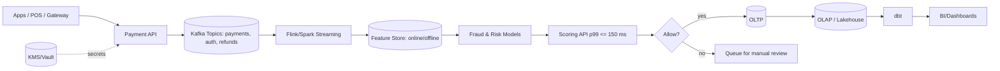

# Full-Stack Developer’s Knowledge Playbook

_Includes VakıfBank 2025 Assessment Prep + Java, System Design & Patterns Deep Dive_  
**Prepared by Orçun Yörük**

<p align="center">
  
</p>


> **New:** FinTech Analytics Addendum — payments KPIs, fraud/risk patterns, real-time scoring, and experimentation notes.  
> **Demo GIF:** See the one-page simulation below.

---

## Quick Nav
- [📑 Abstract](#-abstract)
- [1. Introduction](#1-introduction)
- [2. Exam Overview](#2-exam-overview)
- [3. Java & OOP](#3-java--oop-deep-dive)
- [4. SQL](#4-sql--database-optimization)
- [5. System Design](#5-system-design-essentials)
- [6. CI/CD](#6-cicd-best-practices)
- [7. Testing](#7-testing-strategies)
- [8. Big-O (At-a-glance)](#8-big-o--algorithms)
- [**11. FinTech Addendum (NEW)**](#11-fintech-analytics-addendum-new)
- [📚 Further Reading](#-further-reading--exploration)

---

## 🎞️ Simulation GIF (FinTech Strategy Toggle)


<sup>Toggle **Smart / Loose / Tight** → Auth%, Chargeback%, Net GMV ve p99 Latency eşzamanlı tepki verir.</sup>

---

## 📑 Abstract (short)
A hands-on guide for the **VakıfBank 2025 Full-Stack Assessment** blending **Java/SQL**, **System Design**, **CI/CD**, **Testing**, and **Algorithmic Complexity**.  
Now includes a **FinTech Analytics addendum**: payments KPIs, fraud/risk heuristics, and a real-time scoring sketch.


---

## 1. Introduction  
The VakıfBank exam evaluates applied reasoning, architectural knowledge, and problem-solving under time pressure.  
Candidates must demonstrate:  
- **Java & SQL fluency**  
- Understanding of ***microservices*** vs monolithic apps  
- CI/CD best practices  
- Algorithmic analysis  

---

## 2. Exam Overview  

| Property      | Details |
|---------------|---------|
| Duration      | 28 minutes |
| Questions     | 18 |
| Difficulty    | Medium / Upper-Mid |
| Topics        | Java, SQL, System Design, CI/CD, Testing, Algorithms |

> ⏱️ **Time Tip:** Aim for ~1.5 minutes per question.

---

## 3. Java & OOP Deep Dive  

### 🔹 OOP Principles  
- *Encapsulation* → Protect data with `private`, `protected`, `public`.  
- **Inheritance** → Reuse code via `extends`.  
- ***Polymorphism*** → Method behavior changes per object type.  
- *Abstraction* → Hide internal details.  

### 🔹 Overloading vs Overriding (Listing 1)  
```java
class Calculator {
    int add(int a, int b) { return a + b; }       // Overloading
    double add(double a, double b) { return a + b; }
}
class AdvancedCalculator extends Calculator {
    @Override
    int add(int a, int b) { return a + b + 10; }  // Overriding
}
```
*Caption: Listing 1 — Overloading vs Overriding example in Java.*

---

## 4. SQL & Database Optimization  

### LIKE Example  
```sql
SELECT price
FROM products
WHERE product_name LIKE 'Te%';
```

### UNION vs UNION ALL (Table 1)  
| Feature            | UNION | UNION ALL |
|--------------------|-------|-----------|
| Removes Duplicates | ✅    | ❌ |
| Performance        | Slower| Faster |
| Use Case           | Unique results needed | Large datasets |

### Indexing  
- Useful on `WHERE`, `JOIN`, `ORDER BY`, `GROUP BY`.  
- Avoid on low-selectivity columns (e.g., Gender).  

### SQL Injection Protection (Listing 2)  
```java
PreparedStatement stmt = conn.prepareStatement(
  "SELECT * FROM users WHERE username=? AND password=?"
);
stmt.setString(1, username);
stmt.setString(2, password);
ResultSet rs = stmt.executeQuery();
```
*Caption: Listing 2 — Using PreparedStatement to prevent SQL Injection.*

---

## 5. System Design Essentials  

### Monolithic vs Microservices  
- **Monolith** → One big app, simple start, hard to scale.  
- **Microservices** → Independent services, scalable, but harder to debug/test.  

### Horizontal vs Vertical Scaling (Table 2)  
| Aspect      | Horizontal Scaling | Vertical Scaling |
|-------------|-------------------|------------------|
| Method      | Add servers       | Add CPU/RAM |
| Downtime    | Low ✅            | High ❌ |
| Cost        | Infra cost ↑      | Hardware cost ↑ |
| Performance | Highly scalable ✅| Limited |

---

## 6. CI/CD Best Practices  

- Integrate code **several times per day**.  
- Run **automated tests** on every commit.  
- Avoid **weekly merges** ❌.  
- Avoid isolated long-lived repos ❌.  

> ⚡ **Pro Tip:** Use GitHub Actions or Jenkins to automate build + test pipeline.

---

## 7. Testing Strategies  

- **Statement Coverage** → White-box, every line executed ✅  
- **Functional Testing** → Black-box, checks business logic ❌  
- **Integration Testing** → Ensure modules interact ✅  
- **UAT** → Final business validation ✅  

---
## 8. Big-O--Algorithms

📖 For the full advanced notes, see [BigO_Detailed.md](BigO_Detailed.md)

### O(1) — Constant Time Access

#### Examples
```java
int[] arr = { 4, 8, 15, 16, 23, 42 };
int value = arr[3]; // O(1)

Map<String, Integer> scores = new HashMap<>();
scores.put("ali", 90);
scores.put("ayse", 95);
int ayse = scores.get("ayse"); // average O(1)
```

#### Advanced Techniques
- Direct Addressing with BitSets  
- Jump Tables Instead of if-else Chains  
- Pre-Sizing HashMaps  
- Concurrent Counting with LongAdder  
- Memory-Optimized HashMaps (fastutil)  
- Probabilistic O(1) with Bloom Filters  

---

### O(log N) — Binary Search & Trees

#### Classic Binary Search
```java
int[] sorted = { 3, 5, 9, 12, 18, 27 };
int target = 18;

int lo = 0, hi = sorted.length - 1;
while (lo <= hi) {
    int mid = lo + (hi - lo) / 2;
    if (sorted[mid] == target) break;
    else if (sorted[mid] < target) lo = mid + 1;
    else hi = mid - 1;
}
```

#### Variants & Patterns
- Lower Bound / Upper Bound  
- Binary Search on Answer (Monotonic Predicate)  
- Rotated Sorted Array Search  
- Search in Infinite/Unknown Length Array  
- Balanced BST & Skip Lists  
- FirstTrue / LastTrue Templates  

---

### O(N) — Linear Scan

#### Example
```java
int[] arr = { 7, 2, 9, 4, 11, 5 };
int maxVal = Integer.MIN_VALUE;
for (int x : arr) {
    if (x > maxVal) maxVal = x;
}
```

#### Key Ideas
- Must touch every element once.  
- Used for aggregation (min, max, sum, frequency).  
- Streaming & parallelizable.  

---

### O(N log N) — Sorting

#### Merge Sort Skeleton
```java
void mergeSort(int[] arr, int lo, int hi, int[] buf) {
    if (lo >= hi) return;
    int mid = lo + (hi - lo) / 2;
    mergeSort(arr, lo, mid, buf);
    mergeSort(arr, mid + 1, hi, buf);
    merge(arr, lo, mid, hi, buf);
}
```

#### Techniques
- Merge Sort — stable, predictable.  
- Heap Sort — in-place, no extra memory.  
- TimSort — hybrid, used in Java/Python default sort.  
- K-way Merge — O(N log K) multi-stream merges.  
- Fenwick Tree / Segment Tree Ops — O(N log N) analytics.  
- Longest Increasing Subsequence (patience sorting).  
- Suffix Arrays (doubling method).  
- FFT-based Convolution for polynomial multiplication.  

---

### O(N²) — Quadratic

#### Example
```java
int[] nums = { 5, 3, 4, 1 };
int pairs = 0;
for (int i = 0; i < nums.length; i++) {
    for (int j = i + 1; j < nums.length; j++) {
        if (nums[i] > nums[j]) pairs++;
    }
}
```

#### Patterns
- Pairwise comparison (duplicates, inversions).  
- Naive string search.  
- All-pairs distance in geometry.  
- Matrix multiplication (naive O(N³), optimizations O(N^2.81)).  

---

### Cheat Sheet

| Complexity | Example | Notes |
|------------|---------|-------|
| O(1)       | HashMap lookup | Constant-time, cache effects matter |
| O(log N)   | Binary Search  | Needs sorted/monotonic data |
| O(N)       | Array scan     | Must touch every element |
| O(N log N) | Merge Sort     | Sorting, divide & conquer |
| O(N²)      | Bubble Sort    | Quadratic explosion |

---

## 9. Applied Logic (ARPU, CPI, LTV)

### Example 1 — SaaS Subscription Business (ARPU-driven)
A SaaS company sells a project management tool.  
- Monthly subscription fee = **$12**  
- Average active users = **1,500**  
- Average churn rate = **5% per month**  
- Average customer lifetime = **20 months**  

👉 Calculate the **LTV** per customer.

**Formula**  
LTV = ARPU × Customer Lifetime


**Solution**  
- ARPU = $12  
- LTV = 12 × 20 = **$240 per customer**

📌 **Answer:** Each new customer is worth about **$240** in lifetime value.

---

### Example 2 — Mobile Game Advertising (CPI-driven)
A mobile game studio allocates a **$5,000 marketing budget**.  
- Average CPI = **$0.50**  
- Average ARPDAU = **$0.20**  
- Average lifetime = **30 days**  
- Viral coefficient (K-Factor) = **1.2**  

👉 How much revenue is expected?

**Formula**  
Revenue = (Budget / CPI) × ARPDAU × Lifetime × K


**Solution**  
- Installs = 5000 / 0.50 = 10,000  
- Revenue = 10,000 × 0.20 × 30 × 1.2 = **$72,000**

📌 **Answer:** With a $5,000 spend, expected return is **$72,000** (very high ROI).

---

### Example 3 — E-Commerce Store (LTV vs CPI trade-off)
An online store runs a Facebook Ads campaign.  
- Marketing budget = **$1,000**  
- Average CPI = **$2**  
- Average order value (ARPU equivalent) = **$40**  
- Average repeat purchases per user = **3**  

👉 Which is higher: total ad cost or customer LTV?

**Formula**  
Customer LTV = ARPU × Repeat Purchases

**Solution**  
- Installs (customers) = 1000 / 2 = 500  
- Customer LTV = 40 × 3 = $120  
- Total Customer Value = 500 × 120 = **$60,000**  

📌 **Answer:** Despite a $1,000 cost, the LTV of acquired customers is **$60,000**, campaign is highly profitable.

---

## 10. Final Cheat Sheet (Quick Reference)  

✅ **Java OOP:** Overloading ≠ Overriding  
✅ **SQL:** Use UNION ALL for speed, indexes for performance  
✅ **Scaling:** Horizontal > Vertical for long term  
✅ **CI/CD:** Push daily, test everything  
✅ **Testing:** Statement coverage is king  
✅ **Big-O:** Master O(1), O(logN), O(N), O(N²)  
✅ **Logic:** ARPDAU × LTV × K-Factor formulas  

---

## 11. FinTech Analytics Addendum (NEW)

This addendum highlights **fintech‑focused analytics** you can showcase alongside the VakıfBank 2025 prep: risk, fraud, payments, growth metrics, and real‑time data patterns. It’s designed to be pasted into the README as Section 11 and referenced in interviews.

---

### 11.1 Core KPIs & Quick Formulas

* **Authorization Rate (Auth%)** = Approved / Attempted
* **Chargeback Rate** = Chargebacks / Successful Payments
* **Refund Rate** = Refunds / Successful Payments
* **Take Rate** = Platform Revenue / GMV
* **Gross Margin** = (Revenue − COGS) / Revenue
* **CAC Payback (months)** = CAC / Monthly Gross Profit per Customer
* **Delinquency (30/60/90+)** = Past‑due Principals in Bucket / Total Outstanding
* **PD/LGD/EAD (Risk)**: Probability of Default, Loss Given Default, Exposure at Default (inputs for expected loss = PD × LGD × EAD)

> **Interview spark:** Be ready to explain why Auth% and Chargeback% often trade off when tightening fraud rules.

---

### 11.2 Data Architecture — Real‑Time Scoring Path


**Patterns:** CDC (Debezium) → Kafka → Streaming features → Online store (Redis/Scylla) → Model inferencing → OLAP sync for analytics. SLA targets: **p99 < 200ms**, **99.95%** availability for scoring.

---

### 11.3 Fraud & Risk — Practical Snippets

**Velocity + Amount Band Rule (SQL skeleton)**

```sql
-- Flag users with unusually high amount & count in a short window
WITH tx AS (
  SELECT user_id, amount, status, created_at,
         DATE_TRUNC('minute', created_at) AS m
  FROM payments
  WHERE created_at >= NOW() - INTERVAL '24 hours'
)
, agg AS (
  SELECT user_id, m,
         COUNT(*) AS tx_cnt,
         SUM(amount) AS tx_sum,
         SUM(CASE WHEN status='DECLINED' THEN 1 ELSE 0 END) AS declines
  FROM tx
  GROUP BY user_id, m
)
SELECT *
FROM agg
WHERE tx_cnt >= 5
  AND tx_sum >= 1000
  AND declines >= 2;
```

**Online Features with Cache‑aside (pseudocode)**

```java
// getFeature(userId): try online cache, fall back to OLAP snapshot
Features getFeature(String userId){
  var f = onlineStore.get(userId);
  if (f == null) {
    f = offlineSnapshot.query(userId);
    if (f != null) onlineStore.put(userId, f, TTL_15M);
  }
  return f;
}
```

**Expected Loss (EL) monitor (SQL)**

```sql
SELECT date_trunc('day', asof) d,
       SUM(pd * lgd * ead) AS expected_loss
FROM credit_exposure
GROUP BY 1
ORDER BY 1;
```

> **Note:** For models, track **KS, AUC, population stability (PSI)**, and **drift** on top features.

---

### 11.4 Experimentation & Uplift (Payments & Risk)

* **A/B for Auth Strategy**: Variant A = looser rules (↑Auth, ↑CB risk), Variant B = tighter (↓Auth, ↓CB). Optimize **Net GMV = Approved GMV − Chargeback Loss − Opex**.
* **CUPED (variance reduction)**: `Y* = Y − θ (X − E[X])`, with θ ≈ Cov(Y,X)/Var(X). Use pre‑period conversions as covariate X.
* **Sequential tests** when traffic to risky cohorts is small; cap risk exposure.

---

### 11.5 Compliance & Security Checklist (FinTech)

* **PCI DSS**: Card data tokenization, no PAN storage; quarterly ASV scans.
* **KVKK/GDPR**: Purpose limitation, data minimization, RTBF workflows.
* **SCA/2FA**: PSD2‑style strong customer authentication for high‑risk ops.
* **Audit Trails**: Immutable logs (WORM), time‑sync via NTP.
* **Secrets**: KMS/Vault, short‑lived tokens, rotate keys; no secrets in CI logs.

---

### 11.6 Analytics Dashboards — What to Show

* **Payments Funnel**: Attempt → 3DS → Approved → Settled; drop‑off heatmap by BIN/issuer.
* **Fraud Panel**: Rule hit‑rates, review queue SLA, false‑positive cost.
* **Growth**: Cohort LTV, CAC payback, retention curves.
* **Risk**: PD/LGD drift, EL vs Actual Loss, roll‑rates (30→60→90+).

**Cohort LTV (monthly) sample**

```sql
WITH first_pay AS (
  SELECT user_id, MIN(date_trunc('month', paid_at)) AS cohort
  FROM payments WHERE status='PAID' GROUP BY user_id
), rev AS (
  SELECT p.user_id,
         date_trunc('month', p.paid_at) AS m,
         SUM(p.amount) AS revenue
  FROM payments p WHERE p.status='PAID'
  GROUP BY 1,2
)
SELECT fp.cohort,
       m,
       SUM(revenue) AS cohort_rev,
       COUNT(DISTINCT rev.user_id) AS actives
FROM first_pay fp
JOIN rev ON rev.user_id = fp.user_id
GROUP BY 1,2
ORDER BY 1,2;
```

---

### 11.7 Talking Points (Interview‑Ready)

* *“We optimized Auth% by issuer routing + dynamic 3DS, then guarded CB% via real‑time velocity features.”*
* *“We separated online/offline features to hit p99 < 200ms scoring SLA.”*
* *“Drift monitoring on top 10 features with alerts feeding a retrain queue.”*

---


## 📚 Further Reading & Exploration  
To deepen your understanding and explore the broader context of software engineering, algorithms, and problem-solving, the following resources are highly recommended:

### **Core Software Engineering**
- Gamma, E. et al. — *Design Patterns: Elements of Reusable Object-Oriented Software*
- Fowler, M. — *Patterns of Enterprise Application Architecture*
- Bloch, J. — *Effective Java*
- Martin, R.C. — *Clean Architecture*
- OWASP Foundation — *SQL Injection Prevention Cheat Sheet*
- Sedgewick, R., Wayne, K. — *Algorithms*

### **Algorithmic & Mathematical Foundations**
- Cormen, T.H. et al. — *Introduction to Algorithms (CLRS)*
- Penrose, R. — *The Road to Reality*
- Feynman, R. — *The Feynman Lectures on Physics*
- Turing, A. — *On Computable Numbers*


